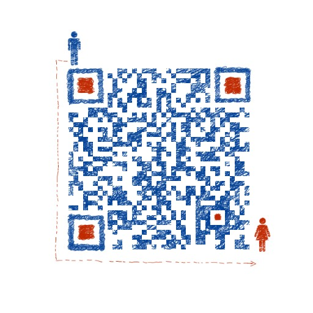

# 机器学习基础知识手册

## 关于本仓库

本仓库包含的小册子《机器学习基础知识手册》，为在本人准备面试时的学习笔记，主要包含以下内容：

- 机器学习基础
- 数学基础
- 贝叶斯分类
- 线性回归
- Logistic回归
- 支持向量机SVM
- 集成学习
- 树模型
- 降维
- 聚类
- 强化学习
- 深度学习
- 优化

由于水平有限以及时间紧张，本手册无法将机器学习的方方面面都涵盖到，对于一些常见机器学习问题肯定还有所遗漏，错误也在所难免。欢迎大家再issues里提出批评与建议、指正错误，也非常欢迎大家为手册扩成内容！

【注】手册里参考了很多网上的内容，在参考文献里附有链接，如果有内容未附上链接或者侵权，请联系作者，谢谢~

**下载地址：**

百度网盘链接：https://pan.baidu.com/s/1cUT-E0guPen20PO5OVjZoQ 
提取码：pbjd 

## 更新日志

- 2020-7-9： 开源第一版，V1.0-2020-7

## 联系作者

- **邮箱：** lixudong16@mails.ucas.edu.cn

- **博客：**
  - CSDN：https://blog.csdn.net/u014157632
  - 个人网站：lixudong.ink
- 欢迎加入我的AI微信群：贾维斯的小屋，扫码添加微信拉你入群~

